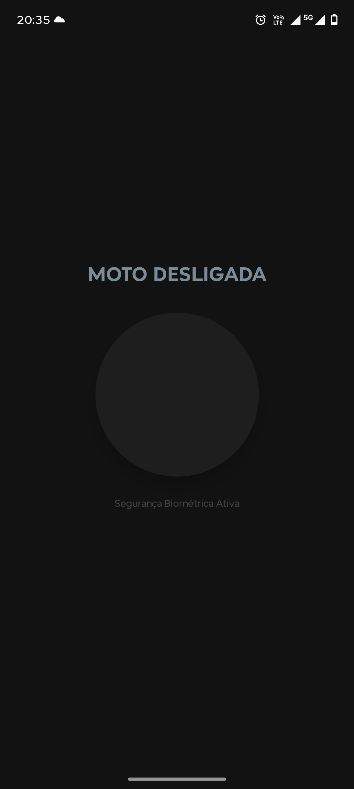
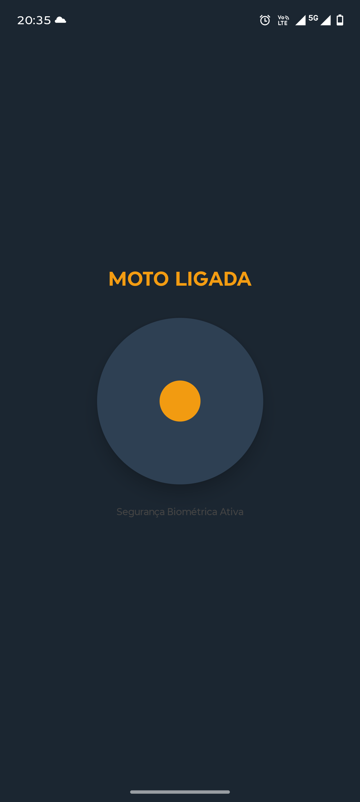
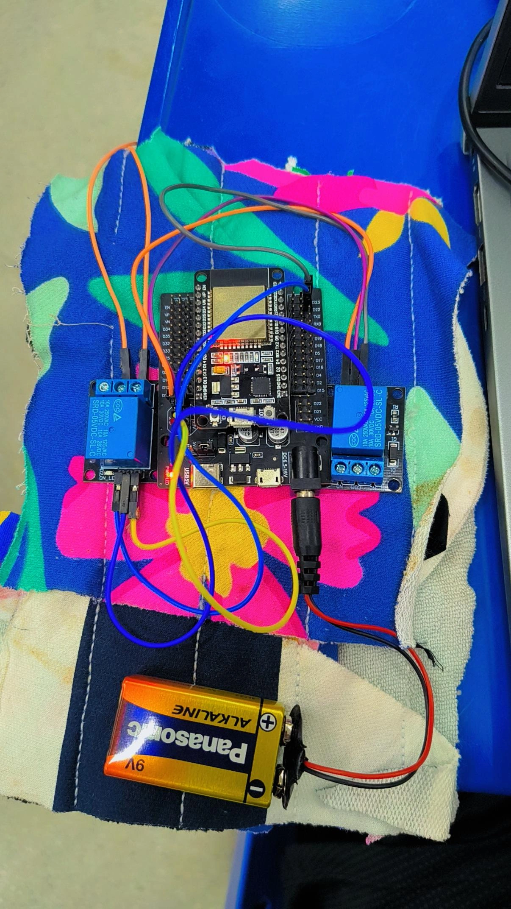
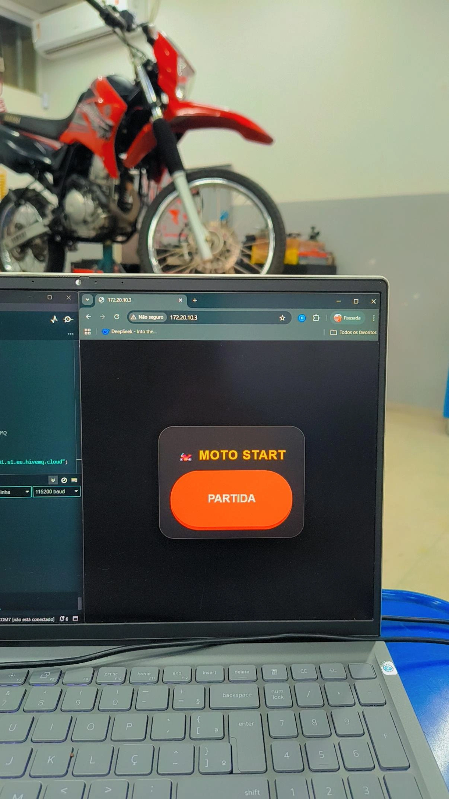
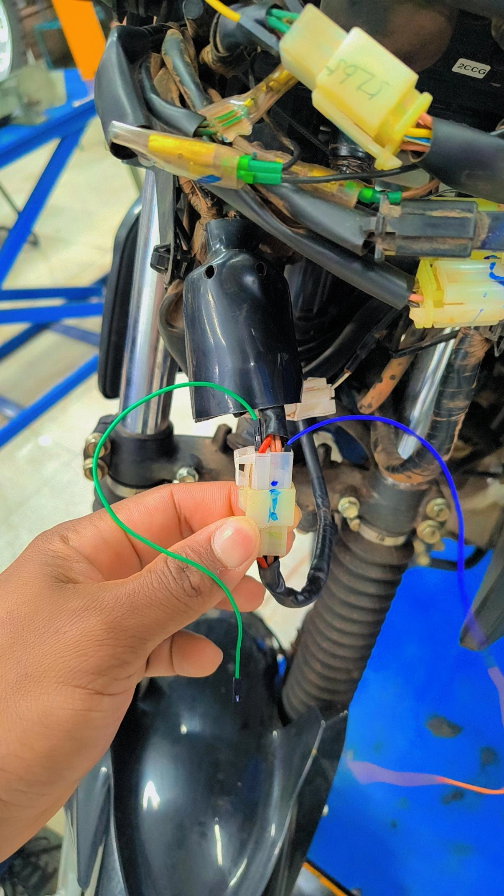
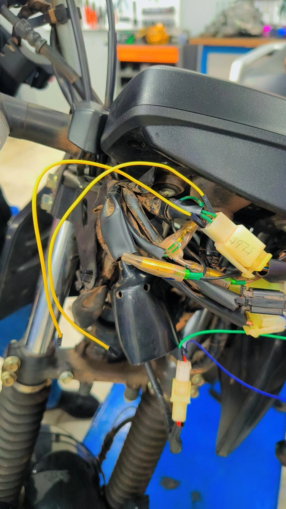
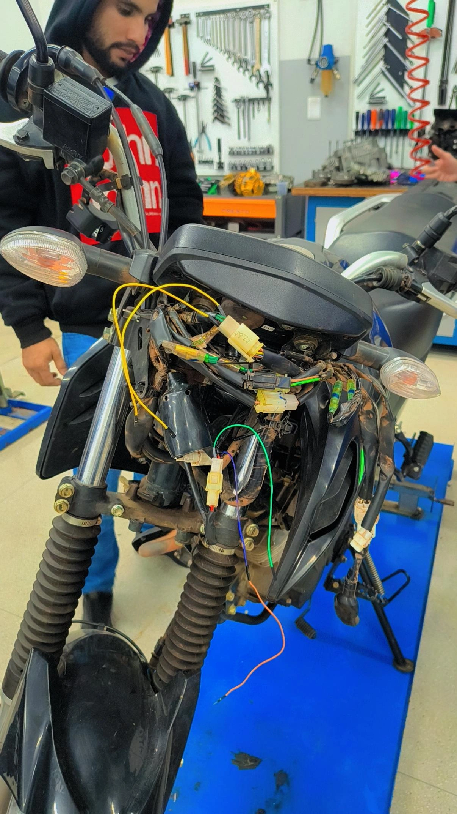

# 🏍️ Moto Start Pro: Controle Total via MQTT & Biometria

O **Moto Start Pro** é um sistema inteligente de controle remoto para motocicletas, permitindo que você ligue a ignição e dê a partida diretamente pelo smartphone. Unindo a robustez do **ESP32** com a velocidade do protocolo **MQTT (HiveMQ Cloud)** e a segurança da **Biometria Android**, este projeto elimina a necessidade de chaves físicas em situações do dia a dia.

---

## 🚀 O que a aplicação faz?
O sistema permite que o usuário gerencie a motocicleta de qualquer lugar do mundo. Através de um aplicativo Android nativo, você pode:
*   **Ligar a Ignição:** Ativa o sistema elétrico da moto.
*   **Dar Partida:** Aciona o motor de arranque com um pulso temporizado (1.5s).
*   **Monitorar o Estado:** Recebe feedback em tempo real se a moto está ligada ou desligada.
*   **Configuração de WiFi Inteligente:** Troque a rede da moto sem precisar de cabos, usando um portal web seguro.

### 💡 Exemplos Reais de Uso
1.  **Aquecimento Prévio:** Ligue a moto da janela de casa para que o motor aqueça enquanto você termina de se arrumar.
2.  **Esquecimento de Chaves:** Se você esqueceu as chaves, mas precisa pegar algo no baú ou ligar a moto, o celular resolve.
3.  **Segurança Adicional:** Use o app como um "corte de ignição" remoto se notar algo suspeito.

---

## 🛠️ Como funciona a comunicação?

O projeto utiliza uma arquitetura em estrela baseada na nuvem:

1.  **ESP32 (A Moto):** Conecta-se ao Wi-Fi e mantém uma conexão segura (TLS) com o **HiveMQ Cloud**. Ele fica ouvindo o tópico `moto/comando`.
2.  **HiveMQ Cloud (O Cérebro):** Funciona como um corretor (Broker) de mensagens. Quando o App envia "LIGAR", o HiveMQ entrega essa mensagem instantaneamente para a moto, não importa a distância.
3.  **App Android (O Controle):** Envia comandos via MQTT e exige **Biometria (Digital ou Rosto)** antes de cada partida, garantindo que só o dono possa ligar o motor.

---

## 📸 Galeria do Projeto

### Interface do Aplicativo
Aqui você pode ver o design moderno e o sistema de autenticação biométrica.

  
  

### Hardware e Instalação
Fotos reais do módulo ESP32 e dos relés instalados.

  
  

  
  
  

---

## ⚙️ Recursos Inteligentes

### 1. Portal de Configuração WiFi (Smart Config)
Se você trocar a senha do seu Wi-Fi ou estiver em um local novo:
1.  O ESP32 criará uma rede chamada `CONFIGURAR_MOTO_ST`.
2.  Conecte seu celular nela e acesse `192.168.4.1`.
3.  Digite o novo Wi-Fi e o ESP32 validará a conexão antes de salvar. **Acabou a necessidade de reprogramar via USB!**

### 2. Painel Web Local
Ao clicar no nome da moto no aplicativo, um painel de controle direto é aberto. O ESP32 informa seu IP local ao aplicativo automaticamente pelo tópico `moto/ip`.

### 3. Partida Segura
A sequência de partida respeita o tempo da bomba de combustível:
*   **Ignição ON** -> Aguarda 2 segundos -> **Motor de Partida ON** (1.5s) -> **Motor de Partida OFF**.

---

## 📥 Como usar?

1.  **ESP32:** Compile e envie o código `appESP2/appESP2.ino` usando a Arduino IDE.
2.  **App:** Instale o arquivo `app-debug.apk` no seu smartphone Android.
3.  **Conexão:** Na primeira vez, conecte-se ao Wi-Fi `CONFIGURAR_MOTO_ST` para configurar a internet da moto.
4.  **Uso:** Abra o app, valide sua biometria e sinta o ronco do motor! 🏍️💨

---
*Desenvolvido com foco em segurança e praticidade para motociclistas.*
